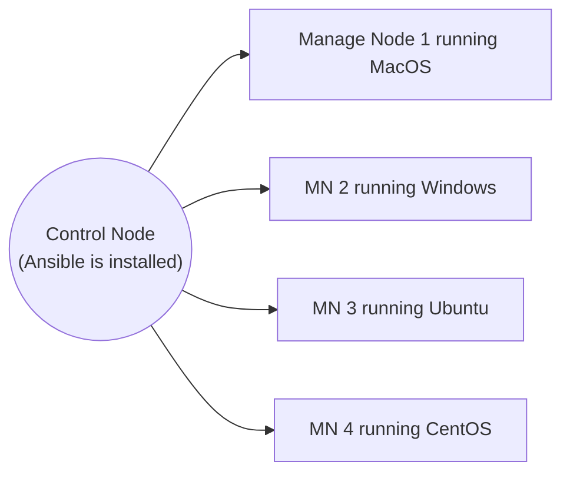

---
tags:
  - cs/devops
status: ongoing
---
##### What, Why & How

The task of maintaining and updating the operating systems, its dependecies and applications for several machines became very difficult for system administrators owing to the difference in package mgmt, configuration etc. 

> [!summary] Ansible 
> It is a **push-based** ==configuration mgmt== solution which is used to handle multiple machines remotely for package mgmt, network firewall etc.
> - Declarative and made using python.
> - Uses SSH for communication with target systems, making it **agentless** and easy to set up.


>[!seealso] 
>Chef is an alternative solution to ansible :-
>- Pull-based: it pulls and updates configuration for all client machines.
>- Steeper learning curve.



**Also used in**
1. Provisioning
2. Deployment
3. Network Automation

**Vs Python & Shell Script**
- Shell script may not work for every platform (ex: windows)
- Python - works everywhere but requires regular maintenance, and no easy authentication service to login remotely. Also a learning curve.


##### Setup

```sh title:Arch
yay -S python-ansible
```

``` title:"IDE Setup"
VSCode
- redhat.ansible
- redhat.vscode-yaml

NeoVim
- ansiblels
- ansible-lint
```

#### Authentication


