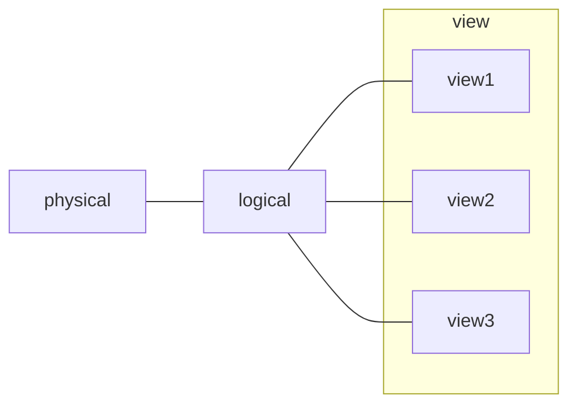

### Levels of Abstraction

- **Physical Level**: describes how a record is stored
- **Logical Level**: descrobes data stored in database, and the relationships among the data
- **View Level**: application programs hide details of data types (also hide certain info for security reasons)



### Schema and Instance

##### Schema
Metadata
- Analogous to type of a variable
**Logical**: the overall logical structure of the db
**Physical**: the overall physical structure of the db

<u>Physical Data Independence</u>: the ability to modify the physical schema without changing the logical schema (because applications are dependent on the logical schema)
##### Instance
The actual content of the database at a particular point in time.
- Analogous to value of a variable

### Data Models
A collection of tools for describing:
- data
- data constraints
- data semantics
- data relationships

Examples:
1. Relational model
2. Entity Relationship Model (ER model)
3. Object-based
4. Semi-structured (XML) (frequently used to exchange data between diff. models)
5. Other:
	- Network model
	- Hierarchical model

##### Data Definition Language (DDL)
To define or modify db schema.
- Data dictionary  generated by DDL compiler contains:
	- Db schema
	- Integrity constraints
	- Authorization (who can access what)

##### Data Manipulation language (DML)
For accessing and manipulating data organized by appropriate data model.
- Also known as query language
- Two classes
	- **Pure** - used for proving properties about computational power and for optimization
		- Relational Algebra
		- Tuple relational calculus
		- Domain relational calculus
	- **Commercial** - used in commercial systems
		- Ex: SQL


### Database Engine

##### Query Processing
![[DBMS - Query Processing.png]]

##### Transaction Management
Collection of operations that performs a single logical operation in a db application is called a transaction.

**Transaction management** ensures the db remains consistent (correct) despite system, transaction failures or concurrent use (**concurrency control manager**)

##### Database Users and Administrators
![[DBMS - db users and admins.png]]

##### Internal DB Structure

![[DBMS - db internal structure.png]]

### Relational Model
Column -> attribute
Row -> tuple
Table -> relation

##### Keys

**Super key**: if K uniquely identifies a tuple
**Candidate key**: if K is minimal
**Primary key**: one key out K keys is selected
**Surrogate key**: synthetically generated key to uniquely identify tuples
**Simple key**; only a single field
**Secondary/Alternate key**: keys in candidate keys other than primary key
**Composite key**: more than one field act as a key
**Foreign key**: value in one relation must appear in another
**Compound key**: a key to uniquely identify that is a collection of simple keys

##### Relational Query Language
Declarative


### SQL

#### DDL
###### Domain Types
- char(n)
- varchar(n)
- int
- smallint
- numeric(p,d)
- real, double precision
- floating

##### Create Table Construct

```SQL title:"Example"
create table instructor (
ID char(5)
name varchar(20) not null,
dept_name varchar(20),
salary (8,2),
primary key (ID),
foreign key (dept_name) references department,
);
```

**Integrity Constraints**
- not null
- primary key ($A_1, \dots ,A_n$)
- foreign key ($A_m, \dots ,A_n$) references $r$

#### DML
##### Updates to Table

```SQL title:"Insert"
insert into instructor values('12011', 'Smith', 'Biology', 66000)
```

```SQL title:"Delete"
-- remove all tuples from the student relation
delete from student
```

```SQL title:"Drop Table"
drop table r
```

```SQL title:"Alter"
-- add attribute A to relation r with domain D. All rows have value null for the new attribute
alter table r add A D
alter table r drop A
```


#### Query

- **select** clause lists the attributes desired in the result of a query
	- corresponds to the projection operation of the relational algebra

```SQL title:"Select Types"
select name from instructor
-- removes duplicates
SELECT DISTINCT dept_name FROM instructor
-- specifies not to remove duplicates
select all name from instructor
-- selects all attributes
select * from instructor
-- can perform basic arithmetic ops and rename resulting attributes
select ID, name, salary/12 as monthly salary from instructor
-- An attribute can be literal
select '437'
select '437' as FOO
```

> [!caution]
> SQL allows duplicates in relations as well as in query results

>[!itip]
> SQL names are case sensitive (i.e $NAME \equiv name \equiv Name$)
> 

- **where** clause specifies conditions that the result must satisfy.
	- corresponds to the selection predicate of the relational algebra

```SQL  title:"Where"
-- comparison results can be combined with logical connectives
select name from instructor where dept_name = 'Comp, Sci' and salary > 8000
```

- **from** caluse lists the relations involved in the query
	- corresponds to the cartesian product operation of relational algebra

```SQL title:"From"
-- generates every possible instructor-teaches pair, with all attributes from both relations
-- fro common attribtues, in result renamed to realtion.attribute (ex: instructor.ID)
select * from instructor, teaches
```

```SQL title:"As"
-- allows renaming relations and attributes
select distinct T.name
from instructor as T, instructor as S
where T.salary > S.salary and S.dept_name = "Comp. Sci"
```

> [!tip]
> Keyword "as" is optional and may be omitted
>-  instructor **as** T $\equiv$ instuctor T

- **string operations** for comparison on chararcter strings using **like** to match patterns using two special characters
	- Percent (%): matches any substring
	- Underscore ( _ ): matches any character

```SQL title:"String Operations"
-- patterns are case-sensitive
select name
from instructor
where name like '%dar%'
```

```SQL title:"Order by"
-- lists the results in alpabetic or numeric order based on attribute(s)
select distinct name
from instructor
order by name, salary desc
```

```SQL title:"Between"
-- to specify a range
select name
from instructor
where salary between 90000 and 100000
```

```SQL title:"Tuple comparison" 
select name, course_id
from instructor, teaches
where (instructor.ID, dept_name) = (teaches.ID, 'Biology')
```

```SQL title:"Set Operations"
-- automically remove duplicates
(select course_id from section where sem = 'Fall' and year = 2009)
union | intersect | except
(select course_id from section where sem = 'Spring' and year = 2010)
-- multiset operations - allow duplicates
union all | intersect all | except all
```

> [!seealso] 
> Null values leads three valued logic -> true, false, unknown
> Except: (unknown **or** true = true), (unknown **and** false) = false,
> most combinations involving unknown lead  to unknown,
> even (**not** unknown) = unknown

```SQL title:"Aggregate Functions"
select avg(salary)
from instructor where dept_name = 'Comp. Sci';

select count(distinct ID)
from teches
where semester = 'Spring' and year = 2010;

-- find avg salary of instructors in each department
select dept_name, avg(salary) as avg_salary
from instructor
group by dept_name
```

> [!warning]
> Attributes in **select** clause outside of aggregate functions must appear in **group by** list

  ```SQL title="Erroneous Query"
  select dept_name, ID, avg(salary)
  from instructor
  group by dept_name;
```

> [!tip]
> **having** clause accompanies **group by** and works as **where** whereas where clause does not take into account group by.


