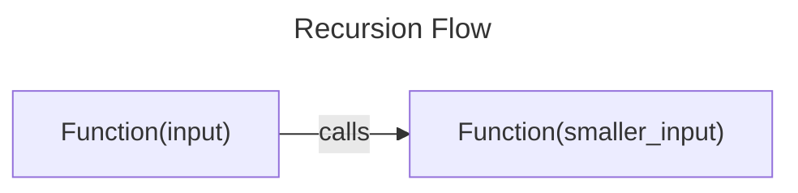
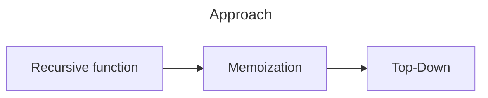

---
tags:
  - cs/programming
---
### Recursion



### Dynamic Programming

Enhanced Recursion -> Recursion + Storage

##### Identify:
1. Choice (recursion with 2 or more calls)
2. Optimal Solution asked (min, max, largest)



##### Parent Problem
- 0-1 knapsack (variations: 6)
- Unbounded  knapsack (5)
- Fibonacci (7)
- Longest Common Subsequence (15)
- LIS (10)
- Kadane's Algorithm (6)
- Matrix Chain Multiplication (7)
- DP on Trees (4)
- DP on Grid (14)
- Others (5)

#### 0-1 Knapsack

==Take / Not Take==

> [!info]
> Given a knapsack (bag) with constrained capacity and items with attitrbutes (weight, value), choose a combination that leads to max profit in bag. [[Knapsack Problem]]

Supply of items is limited  in 0/1 Knapsack.

```Python title:Recursion
def knapsack(wt, val, w, n, t):
# Base Condition
	if (n==0 or w==0):
		return 0
# Choice Diagram
	if (wt[n-1] <= w):
		return max(val[n-1] + knapsack(wt, val, w-wt[n-1], idx+1), knapsack(wt, val, w, n-1))
	elif (wt[n-1] > w):
		return knapsack(wt, val, w, n-1)
```

##### Memoization

> [!tip]
> - Matrix consists of variables that are changing.
> - Initialize matrix with -1


```Python title:Memoization
def knapsack(wt, val, w, n, t):
	if (n==0 or w==0):
		return 0
# Memoization Check
	if  (t[n][w] != -1):
		return t[n][w]
# Memoization
	if (wt[n-1] <= w):
		t[n][w] = max(val[n-1] + knapsack(wt, val, w-wt[n-1], idx+1), knapsack(wt, val, w, n-1))
		return t[n][w]
	elif (wt[n-1] > w):
		t[n][w] = knapsack(wt, val, w, n-1)
		return t[n][w]
```

> [!failure] 
> - Recursion limit may be reached which may make it inefficient in comparison to tabulation in certain problems.

##### Tabulation
- Create matrix with dimensions $[n+1][w+1]$
- Initialize all $i=0$ and $j=0$ indices to 0
- Return matrix$[n][w]$
- 