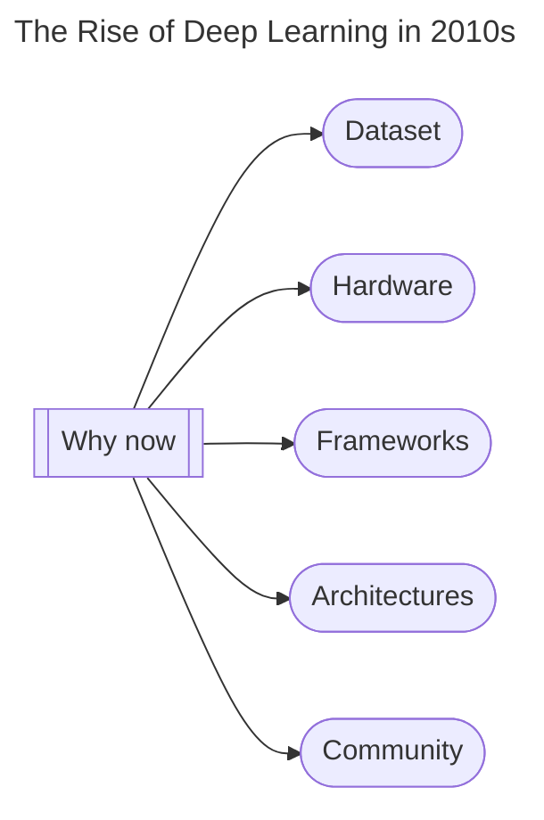

---
tags:
  - deep-learning
  - ai
status: completed
---
**Representational Learning**: Deep learning uses representation/feature learning to automatically extract insights from raw training data without human intervention.

Deep Learning algorithm uses multiple levels to progressively extract higher level features from the raw input.
Ex: In image processing, lower layers  may identify edges, while higher layers may identify concepts relevant to a human such as face, letter, digit etc.

##### Deep Learning vs Machine Learning
- Performs better on **more data**  than machine learning algorithms.
- Requires matrix multiplications so GPU is a necessity, The **hardware is costly**.
- Deep learning models are complex and hence **training times are high**.
- Deep learning automatically extracts features from data using **representation learning**.
- Works like a black box so model is generally **not interpretable**.

##### Types of Neural Networks

1. Multi-Layer Perceptron -> supervised
2. Convolutional NN -> images
3. Recurrent NN -> nlp
4. Auto Encoders -> lossless compression
5. GAN -> generation 

##### History

- 1960s -> perceptron is introduced as the electronic equivalent of human neuron
- 1969 -> AI winter due to XOR problem in perceptron
- 1980s -> Geoffrey Hinton introduced backpropagation
-  1989 -> Yan Le Cun does digit recognition with NNs. Still hardware and lack of data are a problem.
- 1990s -> Another AI winter. ML algos like SVM introduced which converge better on less data.
- 2012 -> The rise. Imagenet Challenge, deep learning on GPU increased accuracy from 26% to 60%.

##### Applications
- Self-driving cars
- Game playing agents
- Virtual Assistants
- Image Colorization
- Adding audio to mute videos
- Image caption generation
- Text Translation
- Pixel Restoration
- Object Detection
- GANs -> pictures, music, handwriting
- Deep Dreaming