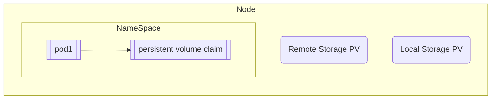

#### Demo Project

#### Namespaces

##### When is required
- Group similar resources (ex: logging, monitoring, elasticsearch)
- Conflicts: many teams, same application
- Resource sharing: staging and deployment use same monitoring and nginx ingress controlle, Blue Green Deployment
- Access and resource limits on namespaces

##### Characteristics
- Cant access most resources from another namespace (ex: configmap, secret)
- Can access services
- Volume and Node Volume among some other components cannot be defined inside a namespace
`kubectl api-services --namespaced=false`

Use namespace in Configmap instead of creating it using kubectl

Install `kubectx` and use `kubens` to set active namespace to avoid writing it in every file

### Ingress
Specify routing rules

##### Ingress Controller
- evaluates all rules
- manages redirections
- entrypoint to cluster
- many third-party implementations (default k8-nginx)

Needs a load balancer (entrypoint) to ingress controller

Can create multiple paths or subdomains
Requires editing /etc/hosts for minikube
TLS can also be configured

### Helm

What is helm ?
Package Manager for K8 
- to package YAML files.
- templating engine (define a common blueprint) common values supplied via values.yaml (practical for CI/CD)
- Same applications deployed across diff. environments (dev, staging, prod)
- Release management

What is Heml Chart ?
packaged YAML files to be used as packages in different k8 projects.
Ex: MySQL, MongoDB, Elastic Search

Some values can be overwritten using another values file that is specified during `helm install`

### Persistent Volume
- Storage doesn't depend on pod lifecycle
- Storage must be available on all nodes
- Needs to survive cluster crashes.

Outside of namespace

Persistent Volume Claim

### Storage Class
Creates persistent volumes dynamixallu based on pv

