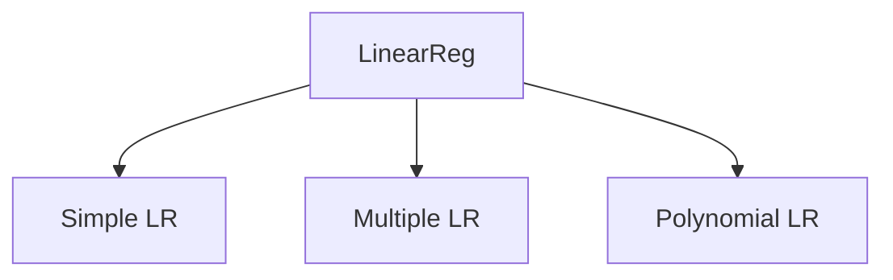
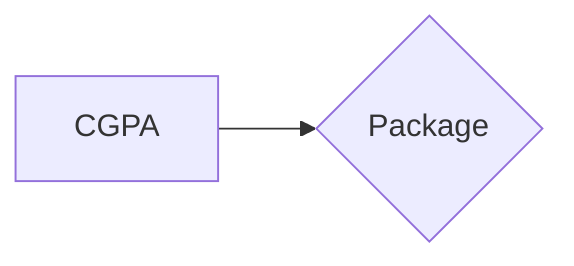
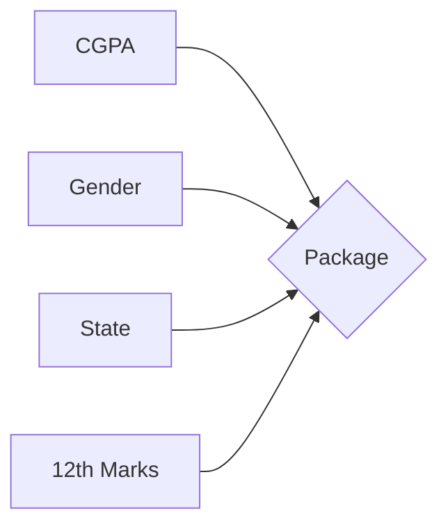

> [!info]
> Computes the linear relationship between the dependent variable and one or more independent features by fitting a best fit linear equation to observed data. $$y=m*x+b$$

- [[Supervised  Learning|Supervised ML]] algo.

#### Assumptions
- <u>Linearity</u>: Relationship between independent and dependent variables is linear.
- <u>Independence</u>: Observations are independent of each other.
- <u>No Multicollinearity</u>: Independent variables are not highly correlated
- [[Homoscedasticity]]: Constant variance of residuals.
- <u>Normality of Residuals</u>: Residuals follow a normal distribution.
- <u>No Autocorrelation</u>: Residuals are not correlated with each other.
- [[Exogeneity]]: Independent variables are not correlated with the error term. The model includes all the relevant independent variables needed to accurately predict the dependent variable.

##### Simple LR
###### Intuition

- Single column input to target mapping.

![[regression_linear_simple-intuition.png]]

>[!tip]
>Two approaches to solve:
>1. Closed form: ordinary least squares
>		1. Open form: gradient descent
###### Derivation
$E = \sum^n_{i=1}d_i^2$ -> Loss Function (difference between points and line)
$d_i=(y_i-\hat{y}_i)^2$
$\hat{y}_i = m*x_i + b$

>[!important] 
>$J(m,b) = \sum^n_{i=1} (y_i-(m*x_i+b))^2$ 
>- Find $m$ and $b$ to minimize loss  (partial derivative of J = 0 to find minima of graph)

![[regression_linear_derivation.jpeg]]

###### [Implementation](https://github.com/ConsularParadi/AI-Algorithms/blob/main/ML/linearRegression.py)
##### Multiple LR
$$\hat{y}=\beta_0+\beta_1x_1+\beta_2x_2+...+\beta_nx_n$$
>[!tip]
>$\beta_{1-n}$ are weights that represent importance of an input in calculating output.

- Multiple columns input to target mapping.

![[regression_linear_multiple_vis.png]]

###### Intuition
$$
\hat{Y} =
\begin{bmatrix}
\hat{y}_{1} \\
\hat{y}_{2} \\
\vdots \\
\hat{y}_{n} \\
\end{bmatrix} = 
\begin{bmatrix}
1 & x_{1_1} & \dots & x_{1_m}\\
1 & x_{2_1} & \dots & x_{2_m}\\
\vdots \\
1 & x_{n_1} & \dots & x_{n_m}\\
\end{bmatrix}
\begin{bmatrix}
\beta_{0} \\
\beta_{1} \\
\vdots \\
\beta_{m} \\
\end{bmatrix}
$$

$$\hat{Y}=X\beta$$
$$e=Y-\hat{Y}$$
$$\begin{aligned}
E &= e^{T}e \\
&= (Y-\hat{Y})^T(Y-\hat{Y}) \\
&= [Y^T-(X\beta)^T](Y-X\beta) \\
&= Y^TY-Y^TX\beta-(X\beta)^TY+(X\beta)^TX\beta \\
&= Y^TY-2*Y^TX\beta +\beta^TX^TX\beta
\end{aligned}
$$

$$\begin{align}
\frac{\partial E}{\partial \beta} &= \frac{\partial}{\partial \beta}[Y^TY-2*Y^TX\beta +\beta^TX^TX\beta] \\
&= 0-2*Y^TX+\frac{\partial}{\partial \beta}[\beta^TX^TX\beta] \\
&= 2X^TX\beta^T=2Y^TX \\
&\implies \beta^T = Y^TX (X^TX)^{-1} \\
&=\beta = ((X^TX)^{-1})^T(Y^TX)^T && (A^{-1})^T=A^{-1}~\text{when A is symmetric}\\
&= (X^TX)^{-1}X^TY
\end{align}
$$

##### Polynomial LR

### Metrics
1. [[Assessment Metrics#Mean Absolute Error (MAE)|MAE]]
2. [[Assessment Metrics#Mean Squared Error (MSE)|MSE]]
3. [[Assessment Metrics#Root Mean Squared Error (RMSE)|RMSE]]
4. [[Assessment Metrics#R2 Score|R2 Score]]
5. [[Assessment Metrics#Adjusted R2 Score|Adjusted R2 Score]]

## Questions

1. Why is a bias term added to the line equation $y=m*x+b$ ?
	1. To allow 0 values in independent variable to map to a non-zero output.

2. Why are there two approaches to solve for $m$ and $b$ in LR?
	1. OLS becomes computationally expensive, numerically unstable, and memory-intensive in high-dimensional settings, making iterative methods like SGD more practical and efficient (large datasets into mini batches).
	2. Formula for OLS -> $\hat{\beta}=(X^TX)^{-1}X^Ty$
		1. The computational complexity of inverting the matrix $X^TX$ is $O(p^3)$, where p is the number of features (dimensions)
		2. Numerical instability due to [[Mathematical Concepts#Multi-Collinearity|multi-collinearity]] which leads to [[Mathematical Concepts#Ill-Conditioned|ill-conditioned matrix]].
		3. High storage space ($n*p$ for $X$ and $p*p$ for $X^TX$)

3. Why use square of distance in loss term ?
	1. If simple summation is used, points on both sides of the line will negate each other's effects.
	2. $|d_i|$ is not used because mod is not differentiable at origin and also we want to penalize outliers.

4.  

>[!references]
>1. [CampusX 100 days ML](https://youtu.be/UZPfbG0jNec?list=PLKnIA16_Rmvbr7zKYQuBfsVkjoLcJgxHH)

