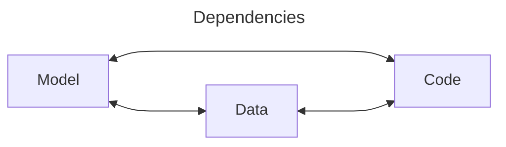
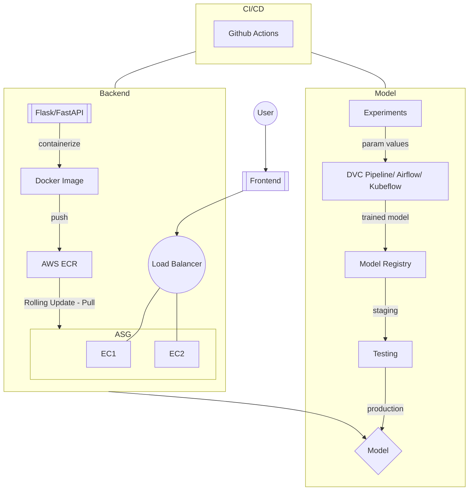

---
tags:
  - ai/mlops
  - version-control
---
### What
Deploying ML products ensuring:-
- Automation
- Reproducibility
- Scalability
- Version Control

### Why


### How

>[!tip]
>[Pathlib](https://docs.python.org/3/library/pathlib.html) provides an easy way to specify file paths without worrying about if the path should be in Windows format or Unix.

#### Templating
A common project structure for ML projects

###### [Cookie Cutter (v2)](https://cookiecutter-data-science.drivendata.org/)

```shell title:"Setup"
pipx install cookiecutter-data-science
ccds
```

### Version Control



#### DVC

- Based on [[Git|git]]

> [!info]
> Tracks the following parameters :-
> - file size
> - file locaton
> - file count in a folder

**Directory Structure**
.dvc
├── config
└── cache (contains local history -> cached previous data, artifacts(model, plots)) 
		
**CLI Commands**
- `dvc init`: initializes dvc tracking in a project
	- `--subdir`: if the project lies in a subdir of git repo

###### Connecting to Different Cloud Providers

```bash title:"AWS S3"
dvc remote add -d storage s3://your-bucket/storage
```

>[!tip]
>Create objects/folders in s3 and give complete path while adding the remote storage in dvc


#### Flow

##### Model Building
1. Data
	- Preprocessing / cleaning
	- EDA
2. Experimention & Experiment Tracking using [[MLFlow]] 
	- Feature Engineering
	- Sampling
	- ML Algorithm Selection 
3. Automated Retraining using [[DVC]]
4. Model Registry
5. Testing
	- Model load test
	- Performance testing 
		- Accuracy threshold
		- Compare with existing model




