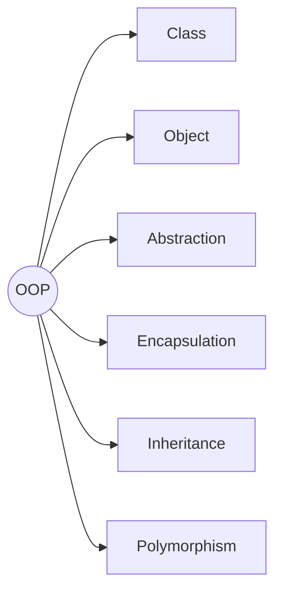
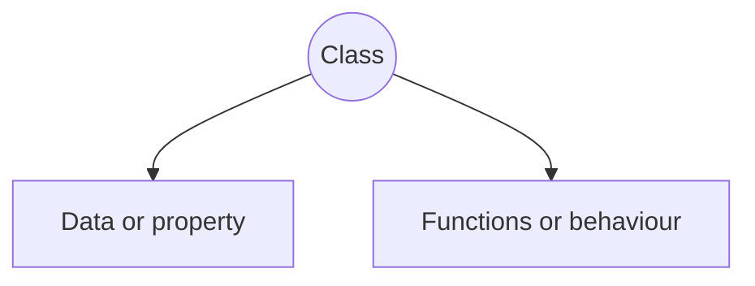
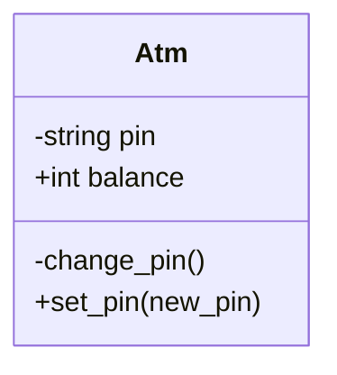

---
tags:
  - cs/programming
status: ongoing
---


### Class

>[!note] 
>Class is a blueprint of how an object will behave



> [!tip]
> - Class name should be in *PascalCase*
> - Function name should be in *snake_case*

##### Method
Functions inside classes are called methods.

##### Constructor
Constructor is a [[Python#Magic Methods|magic method]] that automatically executes on the creation of an object of the class.

##### Self
Self is the current object that has called the method.
- It is useful as even the class methods cannot access other class methods directly.

#### Object

> [!note] 
> Object is an instance of the class.


```python title:"Object vs Object Literal"
# Object instantiation
L = list()

# Object literals are an easier way to instantiate in-built python classes
L = [1,2,3,4]
```


>[!tip]
>Only object of a class can access its attributes and methods
>

#### Class Diagram



### Encapsulation

Restricting access and modification of attributes of a class.

##### Access Modifiers

```python title:"Access modifier in python"
# __ -> To hide data member or method
class Atm:
	def __init__(self) 
		self.balance = 0
		# Private Variable
		self.__pin = 0

	# Private method
	def __change_pin(self):
		pass
```

> [!tip]
> The balance variable is stored in memory as `_Atm__pin`.

>[!danger]
>Nothing in python is truly private. You can change the atm balance attribute by using `object._Atm__pin = "xyz"`. It is just a gentleman's agreement that if a variable has been made private it should not be used.

##### Getters and Setters

```python title:"Get & Set in Python"
class Atm:

	def get_pin(self):
		return self.__pin

	def set_pin(self, new_pin):
		if type(new_pin) == str:
			self.__pin = new_pin
```
