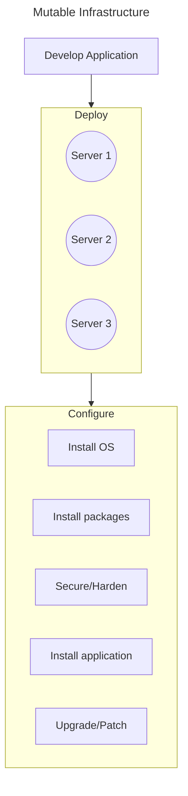

> [!tldr]
> Creates identical images for multiple cloud infrastructure platforms from a single configuration file.

#### Advantages
1. Version controlled
2. Cross platform consistency
3. Automate everything

#### Stages
1. Builder -> platform responsible for creating the image
	- Base Image
2. Provisioners -> are used to provide instructions to configure/modify the base image
3. Post-processors -> run after builders and provisioners and can be used to upload artifacts, compress and repackage files/images

![[Packer - intro.png]]

> [!error] Mutable Infrastructure
> Difficult to configure and maintain multiple servers.
> ==Configuration Drift==

