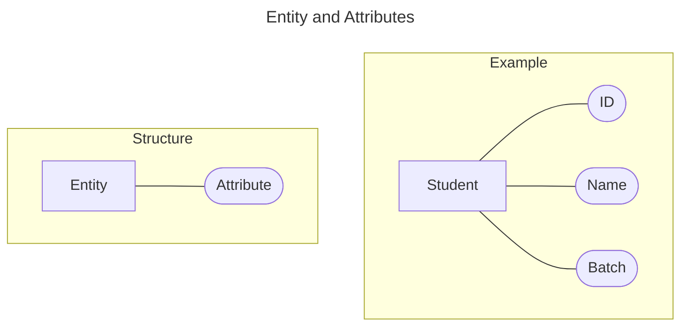
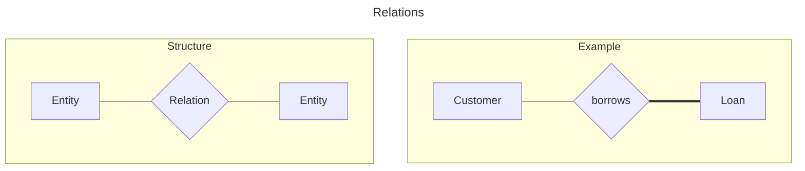
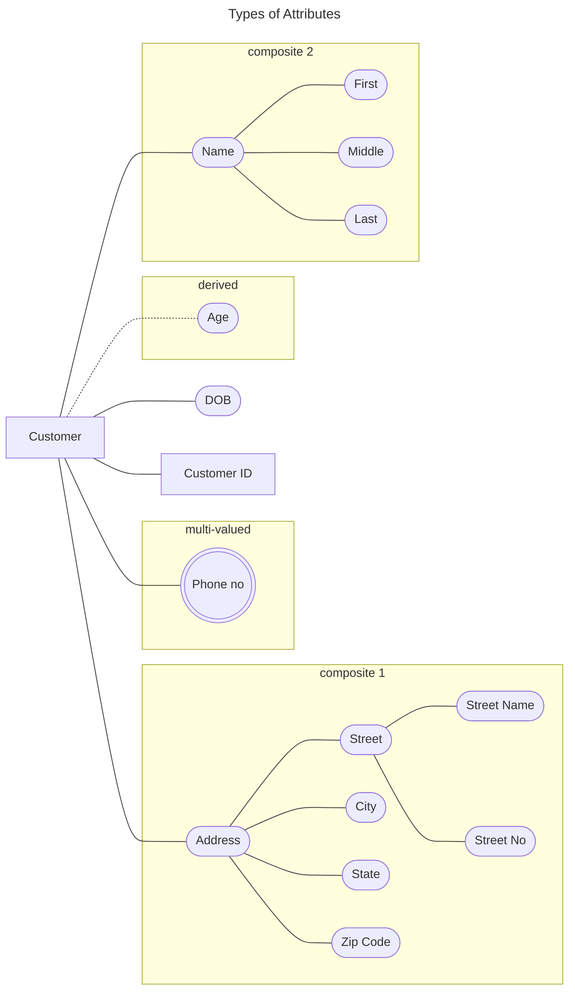
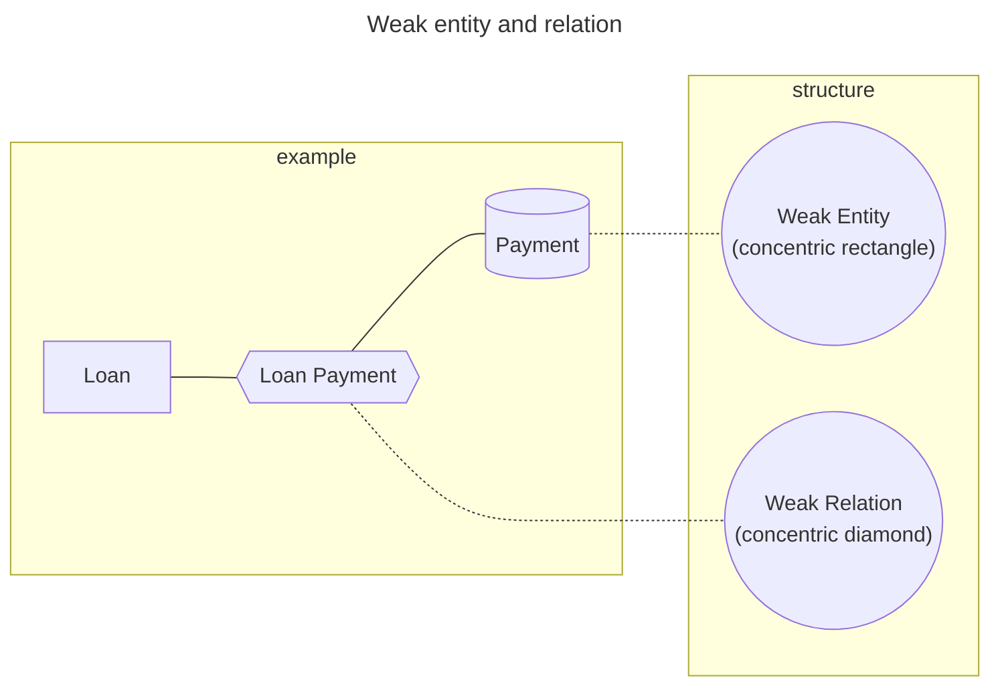
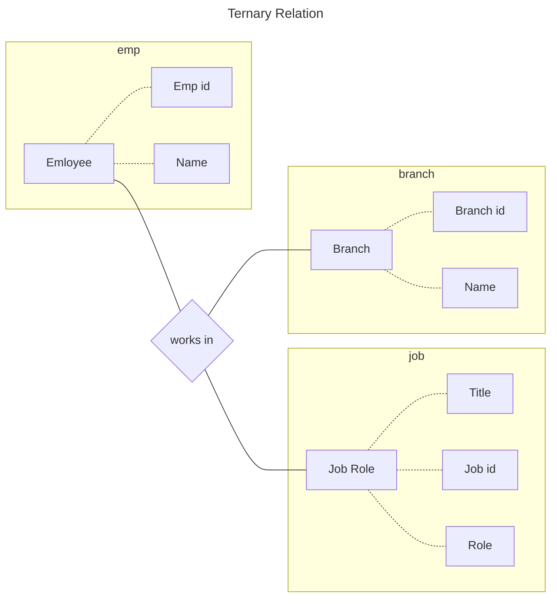
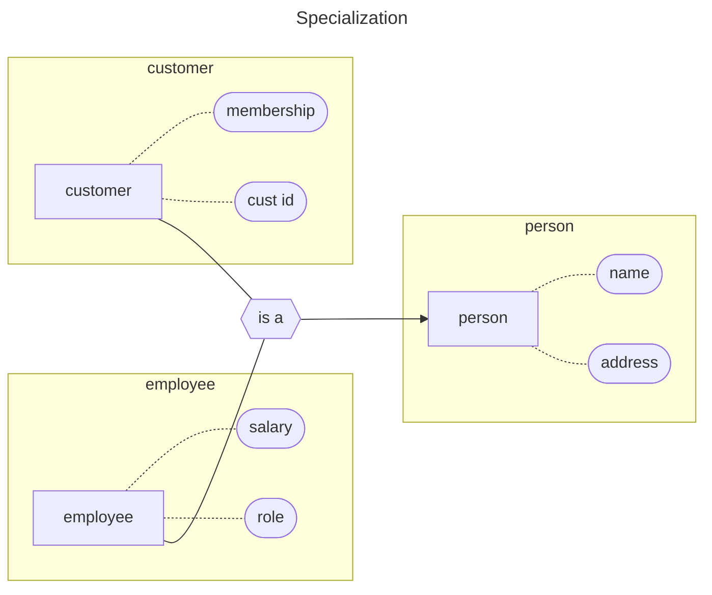
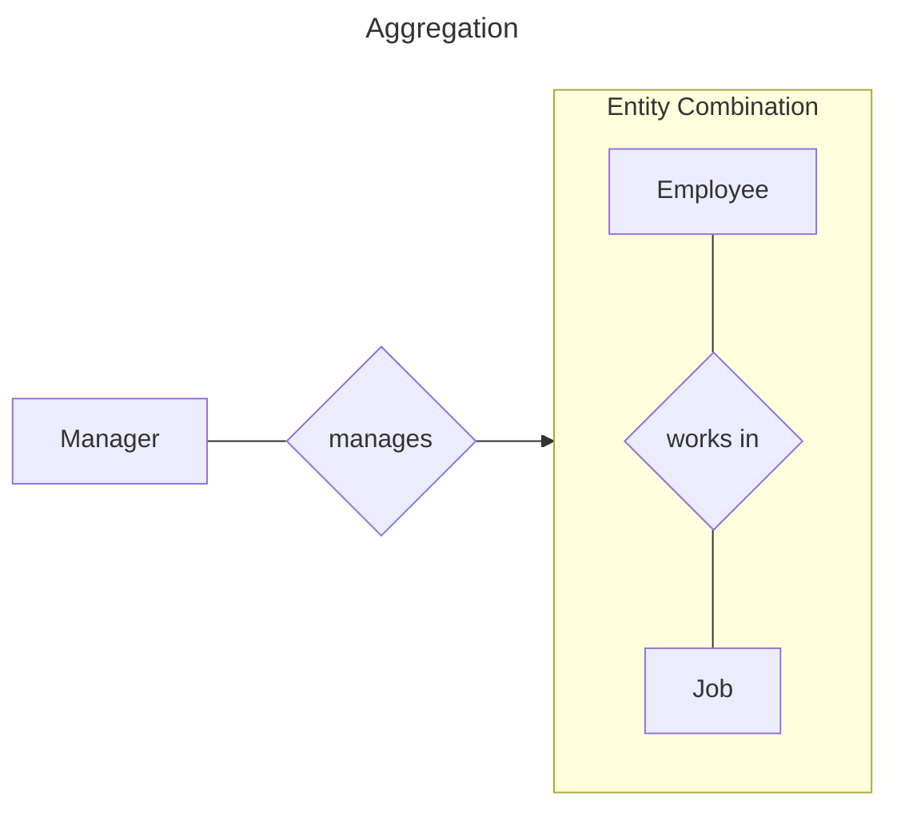

---
tags:
  - cs/engineering
---
![[cs-db-arch.pdf]]
- Security is handled at the external level of db

##### Logical Schema
1. Attributes of table
2. Consistency constraints (Primary Key)
3. Relationships

### Data Models

##### Entity Relationship (ER)

![[dbms_er.pdf]]

- Customer has partial participation with Loan because not all customers buy loans.
- Loan has complete participation with Customer because no loans are without customers.

Here payment depends on loan for existence (or to be uniquely identified), if there is no loan entity, payment entity can be uniquely identified only through load id. Also the payment relation is weak.

- Payment (==Weak Entity==) has total participation while Loan(==Strong==) may/may not have total participation.

## Extended ER

![[dbms_extended-er.pdf]]

##### How to make ER models

1. Identify identity sets
2. Attributes of identities and their types
3. Relationships and constraints
	- Mapping
	- Participation

##### Banking System
- Banking System - branches (name)
- Bank - customers
- Customers - accounts, & loan
- Customers - banker
- Bank - employees
- Accounts - savings, current
- Loan - branch, >=1 customer, payment schedule

1. Entity sets - branch, customer, employee, account, loan, payment schedule
2. Attributes
	- branch: <u>name</u>, city, assets, liabilities
	- customer: <u>customer-id</u>, name, address (composite), contact (multi-valued), DOB, age (derived)
	- employee: <u>emp-id</u>, name, contact, dependent name, start-date (single-valued), years of service
	- savings account: interest rate, daily withdrawal limit
	- current account: per transaction charge, overdraft amount
	- ==Generalized Entity== Account: <u>acc-no</u>, balance
	- loan: <u>loan-no</u>, amount
	- ==Weak Entity== Payment: payment no., date, amount
3. Relationships & Constraints
	- customer borrow loan (m:n, loan in total participation)
	- loan originated by branch (n:1, loan in total participation)
	- loan paid as payment (1:n, total participation)
	- customer deposit account (m:n)
	- customer banker employee (n:1)
	- employee managed by employee (n:1)

![[DBA_banking-er-diagram.png]]

##### Facebook

1. Features and use case
	1. profile -> user_profiles -> friends
	2. user can post
	3. post -> contains text, images, videos
	4. post -> like, comment by other users
2. Entities
	1. user_profile
	2. user_post
	3. post_comment
	4. post_like
3. Attributes + types
	1. user_profile: name (composite), <u>username</u>, email, pwd, contact (muti), DOB, age(derived)
	2. user_post: <u>post_id</u>, (text, images, videos) - multi, created_timestamp, modified_timestamp
	3. post_comment: <u>comment_id</u>, text, timestamp
	4. post_like: <u>like_id</u>, timestamp
4. Relation & Constraints
	1. user_profile friend user_profile (m:n)
	2. user_profile post user_post (1:n, user_post total participation)
	3. user_profile can post_like (1:n, post_like total)
	4. user_profile can post_comment (1:n, post_comment total)
	5. user_profile can post_like (1:n, post_like total)
	6. user_profile can post_like (1:n, post_like total)

![[DBA_facebook-er.png]]