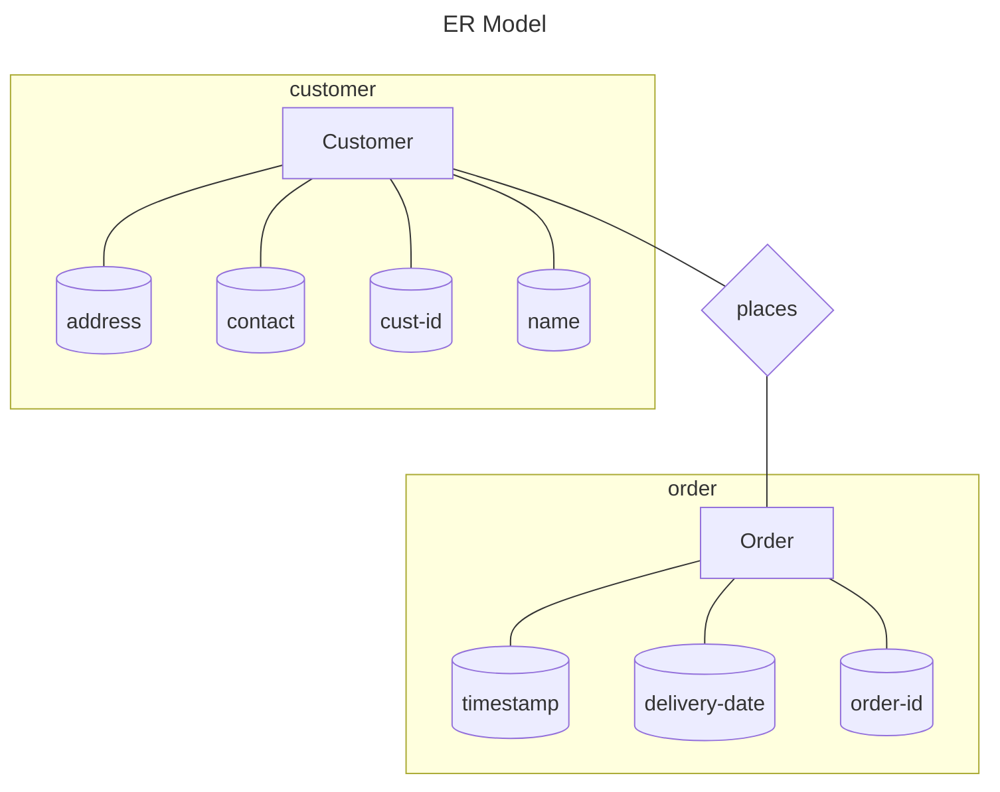

![[Relational Model.pdf]]
Table -> Relation

| Cust-Id | Name   | Address | Contact |
| ------- | ------ | ------- | ------- |
| 1       | Rishi  | ...     | ...     |
| 2       | Sharma | ...     | ...     |

Degree of relation -> no. of attributes (4)
Cardinality -> datapoints (2)

##### ER to Relational

==RDMBS== : software to implement relational model (ex: MySQL, MSAccess, Oracle)

##### Transformation from ER model to Relational model

![[Relational Model transformation from ER.pdf]]

![[DBA_banking-er-diagram.png]]
##### Interview Questions

1. Can we delete from parent table if value is lying in the child table w/o violating delete constraint?
	- **ON Delete Cascade**: Delete value from parent table -> delete corresponding entry from child table too
2. Can F.K have Null value?
	- **ON Delete Null**: deleted value from parent table -> put corresponding FK in child table null