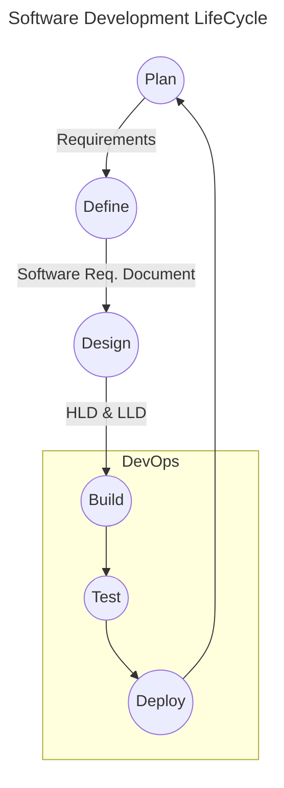

---
tags:
  - cs/devops
---
> [!note] **What**
 Improving application delivery through
> - automation
> - ensuring quality
> - continuous testing
> - continuous monitoring.

#### Infrastructure as Code (IaC)
[[Terraform]]
### Observability
