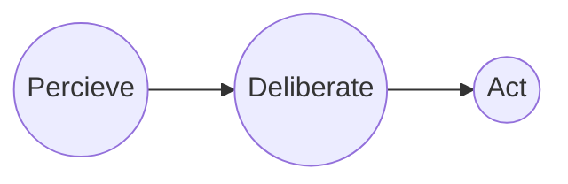
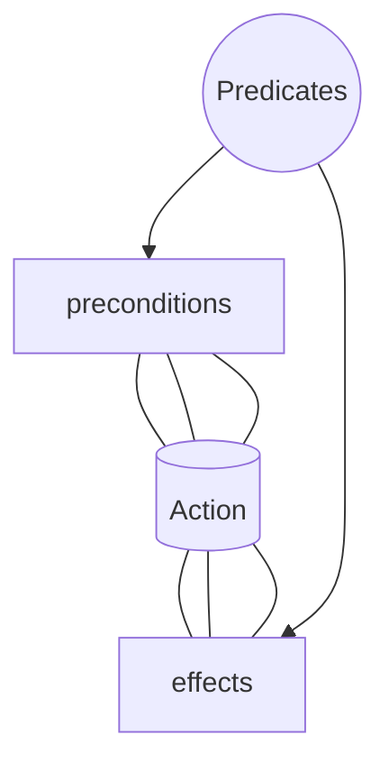

> [!info] 
>  Planning involves **reasoning about intended actions to achieve a desired state**; based on the mental model of the world that the agent has and also the representation of its own actions. 

- Action centric view of problem solving

![[planning.png]]

#### Parameters

1) <u>Perception</u> 
	1) Simplest domain (completely known)
	2) Unknown environment
2) <u>Objectives</u>
	1) Satisfaction goals on end state (have to be achieved)
	2) Soft constraints (may not be achieved)
	3) Hard & soft trajectory constraints (limitations and conditioning of the path taken and not just the final state)
3) <u>Actions</u>
	1) Deterministic (always achieve intended results)
	2) Stochastic (may or may not achieve)
	3) Instantaneous (no notion of time)
	4) Durative (starting and ending time)
	5) Associated cost
4) <u>Dynamic Domain</u>
	1) Extraneous events (rain, shop closed)
	2) Multi-agent systems (may be collaborating, adversarial, competing for common resources)

#### Simple Planning

###### STRIPS Domain

- Stanford Research Institute Planning System
> [!info] 
> - Finite, static and completely observable environment
> - Goals are hard constraints on final state
> - Actions are instantaneous and deterministic 

###### State Transition Systems
$$Y: S X A -> S$$
S, A = Finite set of states and actions

> [!tip] 
> *Y* is a partial function called **state transition function**
> - If action *a* is applicable in state *s*
> - then *y(s,a)* is the resulting state

###### Planning Domain Description Languages

<u>Components of a PDDL tasks</u>:
1) Objects (things in the world that interest us)
2) Predicates (properties of objects we are interested in)
3) Initial State (state of world we start in)
4) Goal Specification (things we want to be true)
5) Actions/Operators (ways of changing state of the world)

#### The Blocks World Domain

![[block world.png]]

###### Predicates
1) <u>on(X,Y)</u>: block X is on block Y
2) <u>ontable(X)</u>: block X in on the table
3) <u>clear(X)</u>: no block is on X
4) <u>holding(X)</u>: robot arm is holding X

###### Actions and Operators
- Operator (schema) and actions (operator's instance)
![[operator structure.png]]

![[predicates_block_domain.png]]

