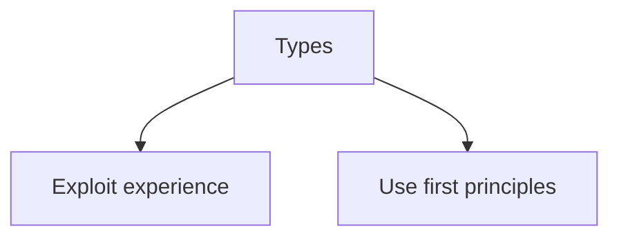
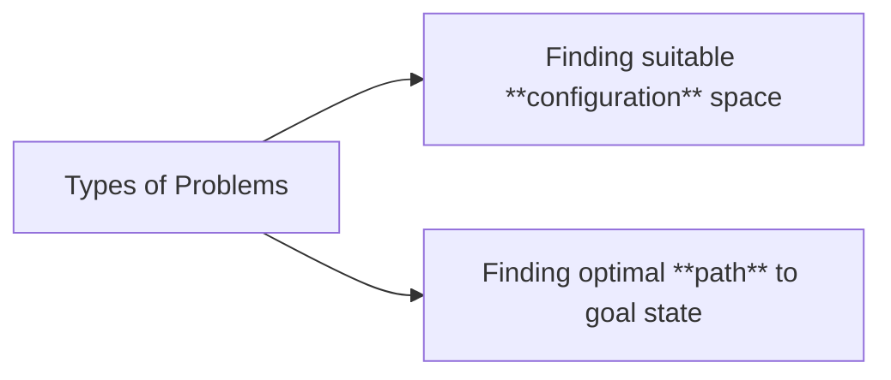

- Also called uninformed algorithms

-> <u>Assumptions</u>:
	- Static and completely known world with representation already available
	- Actions never fail
	- Only one agent changes the world

#### Exploit experience

- Memory based agent that looks into the past.

> [!failure] 
> World is always changing. Similar events may not occur again.

#### First Principle

A trial and error simulation peeks into the future to make decisions

> [!advantage] 
>  The solution is always for the problem being solved.

> [!failure] 
> - Computationally expensive 
> - Reinventing wheel again and again

![[human_problem_solving.png]]

#### Sample Problems

**1) Water Jug Problem**
![[water_jug_1.png]]

![[water_jug_2.png]]
![[water_jug_3 1.png]]

**2) Eight Puzzle**
![[8_puzzle.png]]

**3) Man Goat Lion Challenge**

**4) 6 Queens Problem**
![[6_queen problem.png]]

**5) Map - Coloring Problem**
![[map_coloring_problem.png]]

**6) Travelling Salesman Problem**
![[media/Images/deep learning & ai/search/tsp.png]]

**7) Path finding in a Maze (Graph Search)**
![[maze
_path.png]]

#### Domain Independent Algorithms

- Domain dependent functions are provided to the algorithm by the user.

-> ====Move-Gen==== Function:
A domain function that returns the neighbours of the Node N provided by the user.

-> ====Goal Test ==== Function:
Domain fn that tells you whether a node N is a goal state.

#### Simple Search - v4

1. Maintain 3 lists - OPEN and CLOSED
2. Take start node.
3. While OPEN is not empty, take somenode N from OPEN.
4. $goal_test(N); if yes, return $generate_path(N)
5. If not, append N - node pair in CLOSED.
6. Append node pair (parent + node) from $move_gen(N) in OPEN if neighbours (new nodes) not in OPEN or CLOSED.

> [!warning] 
> This  algorithm is **not deterministic** because how to choose the node is not described

