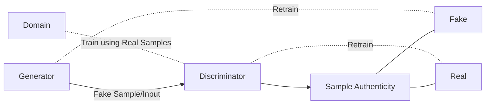

Generative Adversarial Network

[[Unsupervised Learning]] Algorithm

```mermaid
flowchart LR
A[Generator] -->|Fake Sample/Input| B
D --- F[Fake] -.- |Retrain| A
B[Discriminator] --> D[Sample Authenticity] --- E[Real] -.- |Retrain| B
C[Domain] -.-|Train using Real Samples|B
```
 

