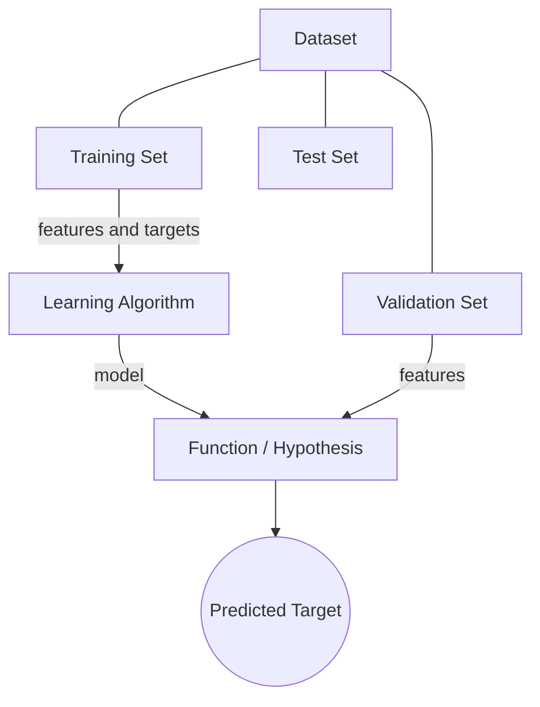

```mermaid 
graph TD
A[Dataset] --- B[Training Set]
A --- C[Validation Set]
A --- D[Test Set]
B -->| features and targets | E[Learning Algorithm]
E -->|model| F[Function / Hypothesis]
C -->|features|F
F --> G((Predicted Target))
```

